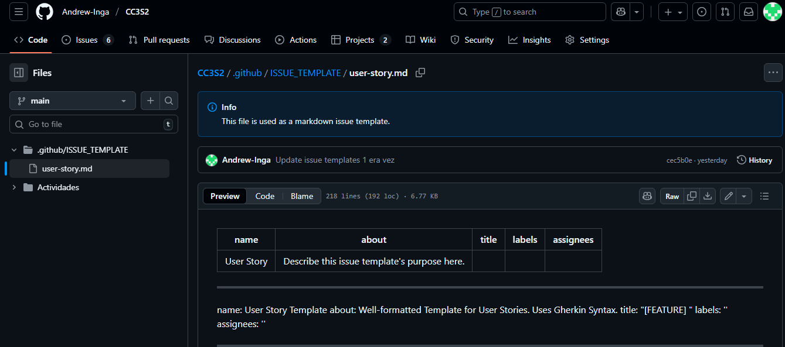

# Actividad 11 - Gestión ágil de proyectos con GitHub Projects, configuración de Kanban Board y creación de historias de usuario

- Nombre: Andrew Owim Inga Rojas 
- Fecha: 21/10/2025
- Tiempo total: 5h
- Entorno usado: IDE Visual Studio Code y Github
## Instrucciones

### Parte 1: Configuración inicial
- **Tablero inicial:** Captura de "Devops-agile" con columnas predeterminadas.

- **Columnas renombradas:** Ready -> **Icebox**, In Review -> **Review/QA**.

#### Parte 2: issue template
- **Configuración:** *Settings > Features > Custom template*.

- **Template User Story:** Markdown de ejemplo.

####  Parte 3: creacion de historias de usario
- **7 Issues:**
  -  *Counter*, *Multiple Counters*, *Persist*, *Reset*, *Deploy*, *Remove*, *Update*

- **Límite:** *New Issues* con límite **7**.

- **Priorización:** *Counter* al inicio de **Product Backlog**, *Multiple Counters* en **Icebox**, resto en **New Issues**.

####  Parte 4: refinamiento del backlog

- **Triage:** *Deploy* bajo *Persist*, *Remove* a **Icebox**, *Update* tras *Reset*.

- **Edición:** Detalles y criterios para todas las historias en **Product Backlog**.

- **Label Technical Debt:** Amarillo `#FBCA04`.

- **Labels Asignados:** **enhancement** para la mayoría, **technical debt** para *Deploy*.

[enlace](# Intrucciones)

#### Ejercicio 1: Epic

#### Ejercicio 2: Etiquetas

- **Labels:** *High/Medium/Low Priority*, *In Review*, *Blocked*, *Ready for Testing*.

#### Ejercicio 3: GitHub Actions
[enlace del workflow](https://github.com/Andrew-Inga/CC3S2/blob/main/.github/workflows/kanban-automation.yml)
Este es un cambio para probar la automatización del PR.
-  **Captura:** YAML y prueba de automatización.

#### Ejercicio 4: Tiempo

- **Campo:** Esfuerzo estimado (horas).

#### Ejercicio 5: Stakeholder Feedback

#### Ejercicio 6: Análisis

- **Métricas:** *Cycle time*, cuellos de botella 

