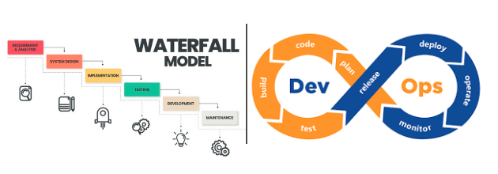

# Actividad 1 - Introducción a DevOps y DevSecOps

-   Andrew Owim Inga Rojas
-   Fecha: 2 de septiembre  
-   Tiempo total invertido: 4h
-   Entorno usado: Esta actividad se realizó en mi laptop personal con el sistema operativo Windows, en el IDE Visual Studio Code.
## 1. DevOps vs. Cascada Tradicional(Investigación + Comparación)

