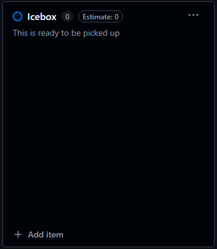
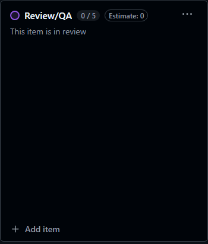
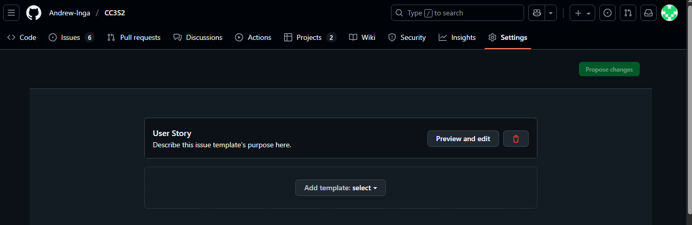
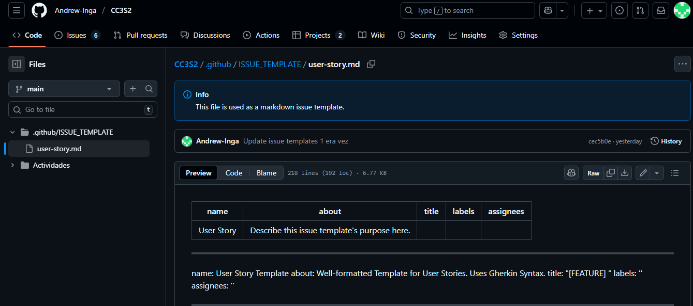
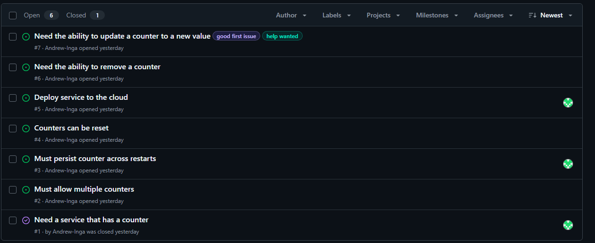

# Actividad 11 - Gestión ágil de proyectos con GitHub Projects, configuración de Kanban Board y creación de historias de usuario

- Nombre: Andrew Owim Inga Rojas 
- Fecha: 21/10/2025
- Tiempo total: 
- Entorno usado: IDE Visual Studio Code y Github
## Instrucciones

### Parte 1: Configuración inicial
- **Tablero inicial:** Captura de "Devops-agile" con columnas predeterminadas.

- **Columnas renombradas:** Ready -> **Icebox**, In Review -> **Review/QA**.

#### Parte 2: issue template
- **Configuración:** *Settings > Features > Custom template*.

- **Template User Story:** Markdown de ejemplo.

####  Parte 3: creacion de historias de usario

